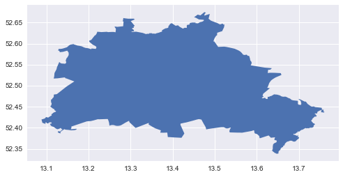
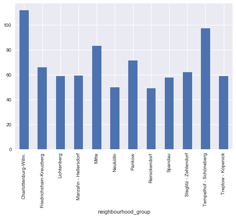
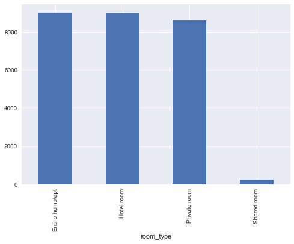
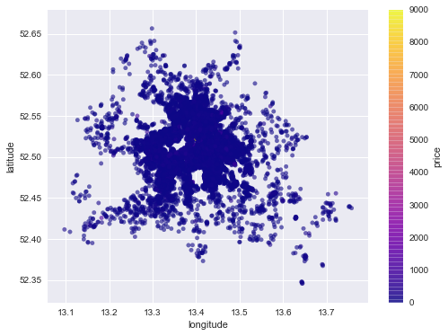
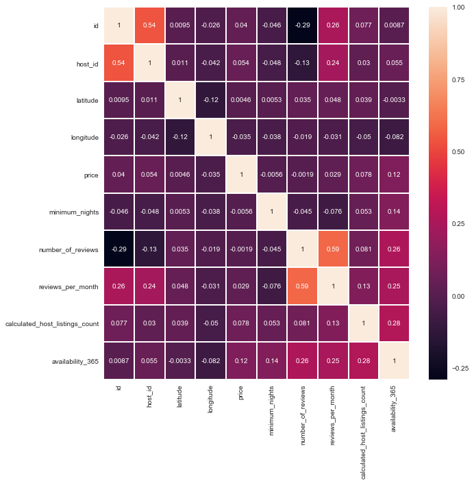

# Berlin Airbnb Dataset Analysis Blog Post

 
A data analysis using Berlin  Germany Airbnb (Date Compiled:19 September, 2019)


### Berlin City Map


```python
#Downloaded https://gist.github.com/pfloh/ae03cdabca0c822d5283 geojson and convert name to Berlin_map
# import libraries
import numpy as np
import pandas as pd
import matplotlib.pyplot as plt
plt.style.use('seaborn')
import seaborn as sns
import geopandas
countries_gdf = geopandas.read_file("Berlin_map.geojson")
countries_gdf.plot()
```


    <matplotlib.axes._subplots.AxesSubplot at 0xbb5c828>





## Introduction

  Berlin is most popular place for visiting area in Germany. The people want to stay in Berlin. Airbnb has been the most popular website for accommodation on recent year. So, I have been curious about Berlin Airbnb Dataset.

## Part 1  Which place is the average most expensive accommodation in Berlin?


```python
# load dataset
listings_df = pd.read_csv('listings.csv')
listings_df.groupby(['neighbourhood_group'])['price'].mean().plot(kind="bar")
```


    <matplotlib.axes._subplots.AxesSubplot at 0xcee4d30>





Charlottenburg-Wilm. is the average most expensive accomodation place in Berlin. Charlottenburg has a lot bar and cafe.  There are alot of old place in Charlottenburg If you want visit this place, You can find a details in this link https://www.visitberlin.de/en/charlottenburg-palace-old-palace

## Part 2 What is the most expensive price on a room type basis?

Entire home/apt is most expensive price on a room type basis. This price is 9.000€.  I had been curios about maximum price per night. So I have learned at now.


```python
listings_df.groupby(['room_type'])['price'].max().plot(kind='bar')
```


    <matplotlib.axes._subplots.AxesSubplot at 0xca6b9e8>





## Part 3 What is the distribution of prices on the basis of latitude and longitude?


```python
listings_df.plot(kind="scatter", x="longitude", y="latitude", alpha=0.6, figsize=(8,6), 
        c="price", cmap="plasma", colorbar=True ,sharex=False)
```


    <matplotlib.axes._subplots.AxesSubplot at 0xcaeb518>





Distribution of prices is on the basis of latitude and longitude on above side. This distribution shows that accomodation preferences is more center than other place. Generally Kreuzberg and Mitte have been popular place.

## Part 4 What is the most correlated three variable with price?


```python
ax = plt.subplots( figsize=(10,10) )
sns.heatmap(listings_df.corr(),annot=True,linewidths=1)
plt.show()
```





Availability_365 is that the most correlated with price. Correlation is 0.12. I had expected that latitude and longitude was correlated

## Conculsion

We can say that room price is higher than other place at city of centre.

We can observe that customers demand to Entire home/apt and Private room in Airbnb.

The most popular places for accomadation in Berlin that is Friedrichshain-Kreuzberg and Mitte in Airbnb.

To see more about this analysis, see the link to my Github available 

If you can stay in Mitte, you will visit this link https://www.airbnb.com.tr/a/Mitte--Germany

If you can stay in Mitte, you will visit this link https://www.airbnb.com.tr/s/Friedrichshain~Kreuzberg--Berlin--Germany

# References

Airbnb Berlin, Germany  http://insideairbnb.com/get-the-data.html. 
    
    Date Compiled:19 September, 2019

Berlin Map http://ontheworldmap.com/germany/city/berlin/berlin-districts-map.html

Berlin Map Geojson https://gist.github.com/pfloh/ae03cdabca0c822d5283
