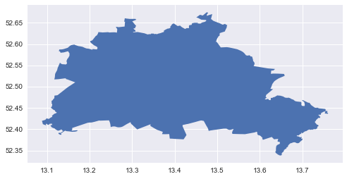
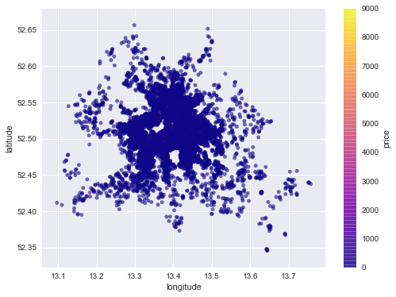
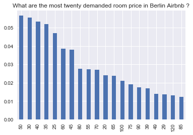
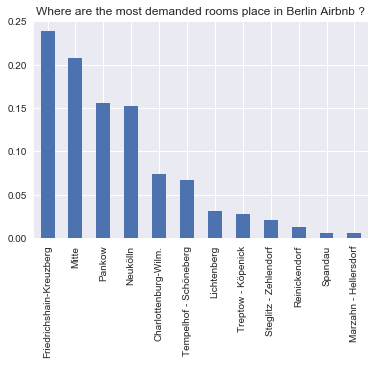
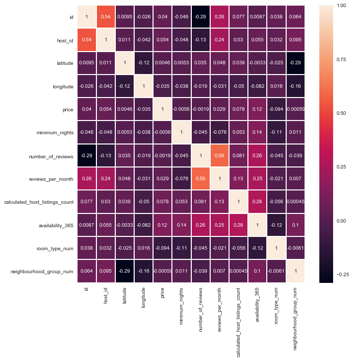

```python
# import libraries
import numpy as np
import pandas as pd
import matplotlib.pyplot as plt
plt.style.use('seaborn')
import seaborn as sns
import geopandas
```


```python
countries_gdf = geopandas.read_file("Berlin_map.geojson")
countries_gdf.plot()
```


    <matplotlib.axes._subplots.AxesSubplot at 0x9ce6ef0>





```python
#Business Understanding
#For this project, I have been interested in using Berlin Airbnb dataset
#1)Which place is the average most expensive accommodation in Berlin?
#2)What is the most expensive price on a room type basis?
#3)What is the distribution of prices on the basis of latitude and longitude?
#4)What is the most correlated three variable with price?
#Please you can create a model about make a prediction of room price. 
```


```python
# load dataset
listings_df = pd.read_csv('listings.csv')
listings_df.head()
```


<div>
<style scoped>
    .dataframe tbody tr th:only-of-type {
        vertical-align: middle;
    }

    .dataframe tbody tr th {
        vertical-align: top;
    }

    .dataframe thead th {
        text-align: right;
    }
</style>
<table border="1" class="dataframe">
  <thead>
    <tr style="text-align: right;">
      <th></th>
      <th>id</th>
      <th>name</th>
      <th>host_id</th>
      <th>host_name</th>
      <th>neighbourhood_group</th>
      <th>neighbourhood</th>
      <th>latitude</th>
      <th>longitude</th>
      <th>room_type</th>
      <th>price</th>
      <th>minimum_nights</th>
      <th>number_of_reviews</th>
      <th>last_review</th>
      <th>reviews_per_month</th>
      <th>calculated_host_listings_count</th>
      <th>availability_365</th>
    </tr>
  </thead>
  <tbody>
    <tr>
      <th>0</th>
      <td>1944</td>
      <td>cafeheaven Pberg/Mitte/Wed for the summer 2019</td>
      <td>2164</td>
      <td>Lulah</td>
      <td>Mitte</td>
      <td>Brunnenstr. Nord</td>
      <td>52.54425</td>
      <td>13.39749</td>
      <td>Private room</td>
      <td>21</td>
      <td>120</td>
      <td>18</td>
      <td>2018-11-11</td>
      <td>0.25</td>
      <td>1</td>
      <td>364</td>
    </tr>
    <tr>
      <th>1</th>
      <td>2015</td>
      <td>Berlin-Mitte Value! Quiet courtyard/very central</td>
      <td>2217</td>
      <td>Ion</td>
      <td>Mitte</td>
      <td>Brunnenstr. Süd</td>
      <td>52.53454</td>
      <td>13.40256</td>
      <td>Entire home/apt</td>
      <td>60</td>
      <td>4</td>
      <td>127</td>
      <td>2019-09-05</td>
      <td>3.03</td>
      <td>5</td>
      <td>170</td>
    </tr>
    <tr>
      <th>2</th>
      <td>3176</td>
      <td>Fabulous Flat in great Location</td>
      <td>3718</td>
      <td>Britta</td>
      <td>Pankow</td>
      <td>Prenzlauer Berg Südwest</td>
      <td>52.53500</td>
      <td>13.41758</td>
      <td>Entire home/apt</td>
      <td>90</td>
      <td>62</td>
      <td>145</td>
      <td>2019-06-27</td>
      <td>1.16</td>
      <td>1</td>
      <td>349</td>
    </tr>
    <tr>
      <th>3</th>
      <td>3309</td>
      <td>BerlinSpot Schöneberg near KaDeWe</td>
      <td>4108</td>
      <td>Jana</td>
      <td>Tempelhof - Schöneberg</td>
      <td>Schöneberg-Nord</td>
      <td>52.49885</td>
      <td>13.34906</td>
      <td>Private room</td>
      <td>28</td>
      <td>7</td>
      <td>27</td>
      <td>2019-05-31</td>
      <td>0.36</td>
      <td>1</td>
      <td>262</td>
    </tr>
    <tr>
      <th>4</th>
      <td>6883</td>
      <td>Stylish East Side Loft in Center with AC &amp; 2 b...</td>
      <td>16149</td>
      <td>Steffen</td>
      <td>Friedrichshain-Kreuzberg</td>
      <td>Frankfurter Allee Süd FK</td>
      <td>52.51171</td>
      <td>13.45477</td>
      <td>Entire home/apt</td>
      <td>125</td>
      <td>3</td>
      <td>126</td>
      <td>2019-09-08</td>
      <td>1.08</td>
      <td>1</td>
      <td>7</td>
    </tr>
  </tbody>
</table>
</div>


```python
# number of data
listings_df.shape[0]
```


    24422


```python
# data format for each column
listings_df.info()
```

    <class 'pandas.core.frame.DataFrame'>
    RangeIndex: 24422 entries, 0 to 24421
    Data columns (total 16 columns):
    id                                24422 non-null int64
    name                              24371 non-null object
    host_id                           24422 non-null int64
    host_name                         24390 non-null object
    neighbourhood_group               24422 non-null object
    neighbourhood                     24422 non-null object
    latitude                          24422 non-null float64
    longitude                         24422 non-null float64
    room_type                         24422 non-null object
    price                             24422 non-null int64
    minimum_nights                    24422 non-null int64
    number_of_reviews                 24422 non-null int64
    last_review                       20286 non-null object
    reviews_per_month                 20286 non-null float64
    calculated_host_listings_count    24422 non-null int64
    availability_365                  24422 non-null int64
    dtypes: float64(3), int64(7), object(6)
    memory usage: 3.0+ MB
    


```python
# What kind information is provied?
listings_df.columns
```


    Index(['id', 'name', 'host_id', 'host_name', 'neighbourhood_group',
           'neighbourhood', 'latitude', 'longitude', 'room_type', 'price',
           'minimum_nights', 'number_of_reviews', 'last_review',
           'reviews_per_month', 'calculated_host_listings_count',
           'availability_365'],
          dtype='object')


```python
# missing values
listings_df.isnull().sum()
```


    id                                   0
    name                                51
    host_id                              0
    host_name                           32
    neighbourhood_group                  0
    neighbourhood                        0
    latitude                             0
    longitude                            0
    room_type                            0
    price                                0
    minimum_nights                       0
    number_of_reviews                    0
    last_review                       4136
    reviews_per_month                 4136
    calculated_host_listings_count       0
    availability_365                     0
    dtype: int64


```python
#describe
listings_df.describe()
```


<div>
<style scoped>
    .dataframe tbody tr th:only-of-type {
        vertical-align: middle;
    }

    .dataframe tbody tr th {
        vertical-align: top;
    }

    .dataframe thead th {
        text-align: right;
    }
</style>
<table border="1" class="dataframe">
  <thead>
    <tr style="text-align: right;">
      <th></th>
      <th>id</th>
      <th>host_id</th>
      <th>latitude</th>
      <th>longitude</th>
      <th>price</th>
      <th>minimum_nights</th>
      <th>number_of_reviews</th>
      <th>reviews_per_month</th>
      <th>calculated_host_listings_count</th>
      <th>availability_365</th>
    </tr>
  </thead>
  <tbody>
    <tr>
      <th>count</th>
      <td>2.442200e+04</td>
      <td>2.442200e+04</td>
      <td>24422.000000</td>
      <td>24422.000000</td>
      <td>24422.000000</td>
      <td>24422.000000</td>
      <td>24422.000000</td>
      <td>20286.000000</td>
      <td>24422.000000</td>
      <td>24422.000000</td>
    </tr>
    <tr>
      <th>mean</th>
      <td>1.967378e+07</td>
      <td>6.925398e+07</td>
      <td>52.509852</td>
      <td>13.405645</td>
      <td>72.654942</td>
      <td>6.917247</td>
      <td>20.514372</td>
      <td>1.123973</td>
      <td>2.183851</td>
      <td>74.000942</td>
    </tr>
    <tr>
      <th>std</th>
      <td>1.110612e+07</td>
      <td>7.704310e+07</td>
      <td>0.031510</td>
      <td>0.059636</td>
      <td>228.393529</td>
      <td>23.838359</td>
      <td>43.127318</td>
      <td>1.554836</td>
      <td>4.429958</td>
      <td>115.357343</td>
    </tr>
    <tr>
      <th>min</th>
      <td>1.944000e+03</td>
      <td>2.058000e+03</td>
      <td>52.345800</td>
      <td>13.097180</td>
      <td>0.000000</td>
      <td>1.000000</td>
      <td>0.000000</td>
      <td>0.010000</td>
      <td>1.000000</td>
      <td>0.000000</td>
    </tr>
    <tr>
      <th>25%</th>
      <td>9.922960e+06</td>
      <td>1.055462e+07</td>
      <td>52.489010</td>
      <td>13.373900</td>
      <td>33.000000</td>
      <td>2.000000</td>
      <td>1.000000</td>
      <td>0.150000</td>
      <td>1.000000</td>
      <td>0.000000</td>
    </tr>
    <tr>
      <th>50%</th>
      <td>2.010907e+07</td>
      <td>3.737860e+07</td>
      <td>52.509305</td>
      <td>13.416310</td>
      <td>50.000000</td>
      <td>3.000000</td>
      <td>5.000000</td>
      <td>0.510000</td>
      <td>1.000000</td>
      <td>1.000000</td>
    </tr>
    <tr>
      <th>75%</th>
      <td>2.907823e+07</td>
      <td>1.061518e+08</td>
      <td>52.532680</td>
      <td>13.439578</td>
      <td>75.000000</td>
      <td>4.000000</td>
      <td>18.000000</td>
      <td>1.480000</td>
      <td>2.000000</td>
      <td>107.000000</td>
    </tr>
    <tr>
      <th>max</th>
      <td>3.873117e+07</td>
      <td>2.961293e+08</td>
      <td>52.656630</td>
      <td>13.757640</td>
      <td>9000.000000</td>
      <td>1000.000000</td>
      <td>582.000000</td>
      <td>39.510000</td>
      <td>49.000000</td>
      <td>365.000000</td>
    </tr>
  </tbody>
</table>
</div>


```python
listings_df.room_type.value_counts()
```


    Entire home/apt    12136
    Private room       11638
    Hotel room           348
    Shared room          300
    Name: room_type, dtype: int64


```python
listings_df.neighbourhood_group.value_counts()
```


    Friedrichshain-Kreuzberg    5830
    Mitte                       5061
    Pankow                      3810
    Neukölln                    3717
    Charlottenburg-Wilm.        1798
    Tempelhof - Schöneberg      1634
    Lichtenberg                  761
    Treptow - Köpenick           677
    Steglitz - Zehlendorf        506
    Reinickendorf                318
    Spandau                      159
    Marzahn - Hellersdorf        151
    Name: neighbourhood_group, dtype: int64


```python
#Compare selected indicators between western and eastern
listings_df_1=['neighbourhood_group','room_type','price']
comparison = listings_df.groupby(['neighbourhood_group'])['price'].mean()
comparison
```


    neighbourhood_group
    Charlottenburg-Wilm.        111.719689
    Friedrichshain-Kreuzberg     66.033448
    Lichtenberg                  58.856767
    Marzahn - Hellersdorf        59.430464
    Mitte                        83.081012
    Neukölln                     50.086360
    Pankow                       71.639370
    Reinickendorf                49.097484
    Spandau                      57.691824
    Steglitz - Zehlendorf        62.073123
    Tempelhof - Schöneberg       97.331701
    Treptow - Köpenick           59.000000
    Name: price, dtype: float64


```python
def listings_df_room_type(listings_df):
    """
    
    Convert room_type from words to integer for calculating the mean
    
    Parameters:
    listings_df: a dataframe that will be converted
    
    Returns:
    dataframe: a converted dataframe with room_type column becomes measurable
    
    """
    room_type_map = {
        'Entire home/apt' : 1,
        'Hotel room' : 2,
        'Private room' : 3,
        'Shared room' : 4,
        np.nan: np.nan
    }
    listings_df['room_type_num'] = listings_df['room_type'].apply(lambda x: np.nan if x == np.nan else room_type_map[x] )
    
    return listings_df
```


```python
def listings_df_neighbourhood_group(listings_df):
    """
    
    Convert neighbourhood_group from words to integer for calculating the mean
    
    Parameters:
    listings_df: a dataframe that will be converted
    
    Returns:
    dataframe: a converted dataframe with neighbourhood_group column becomes measurable
    
    """
    neighbourhood_group_map = {
'Friedrichshain-Kreuzberg' :1
,'Mitte' :2
,'Pankow' :3
,'Neukölln' :4
,'Charlottenburg-Wilm.' :5
,'Tempelhof - Schöneberg' :6
,'Lichtenberg' :7
,'Treptow - Köpenick' :8
,'Steglitz - Zehlendorf' :9
,'Reinickendorf' :10
,'Spandau' :11
,'Marzahn - Hellersdorf':12,
        np.nan: np.nan
    }
    listings_df['neighbourhood_group_num'] = listings_df['neighbourhood_group'].apply(lambda x: np.nan if x == np.nan else neighbourhood_group_map[x] )
    
    return listings_df
```


```python
listings_df_room_type(listings_df)
```


<div>
<style scoped>
    .dataframe tbody tr th:only-of-type {
        vertical-align: middle;
    }

    .dataframe tbody tr th {
        vertical-align: top;
    }

    .dataframe thead th {
        text-align: right;
    }
</style>
<table border="1" class="dataframe">
  <thead>
    <tr style="text-align: right;">
      <th></th>
      <th>id</th>
      <th>name</th>
      <th>host_id</th>
      <th>host_name</th>
      <th>neighbourhood_group</th>
      <th>neighbourhood</th>
      <th>latitude</th>
      <th>longitude</th>
      <th>room_type</th>
      <th>price</th>
      <th>minimum_nights</th>
      <th>number_of_reviews</th>
      <th>last_review</th>
      <th>reviews_per_month</th>
      <th>calculated_host_listings_count</th>
      <th>availability_365</th>
      <th>room_type_num</th>
    </tr>
  </thead>
  <tbody>
    <tr>
      <th>0</th>
      <td>1944</td>
      <td>cafeheaven Pberg/Mitte/Wed for the summer 2019</td>
      <td>2164</td>
      <td>Lulah</td>
      <td>Mitte</td>
      <td>Brunnenstr. Nord</td>
      <td>52.54425</td>
      <td>13.39749</td>
      <td>Private room</td>
      <td>21</td>
      <td>120</td>
      <td>18</td>
      <td>2018-11-11</td>
      <td>0.25</td>
      <td>1</td>
      <td>364</td>
      <td>3</td>
    </tr>
    <tr>
      <th>1</th>
      <td>2015</td>
      <td>Berlin-Mitte Value! Quiet courtyard/very central</td>
      <td>2217</td>
      <td>Ion</td>
      <td>Mitte</td>
      <td>Brunnenstr. Süd</td>
      <td>52.53454</td>
      <td>13.40256</td>
      <td>Entire home/apt</td>
      <td>60</td>
      <td>4</td>
      <td>127</td>
      <td>2019-09-05</td>
      <td>3.03</td>
      <td>5</td>
      <td>170</td>
      <td>1</td>
    </tr>
    <tr>
      <th>2</th>
      <td>3176</td>
      <td>Fabulous Flat in great Location</td>
      <td>3718</td>
      <td>Britta</td>
      <td>Pankow</td>
      <td>Prenzlauer Berg Südwest</td>
      <td>52.53500</td>
      <td>13.41758</td>
      <td>Entire home/apt</td>
      <td>90</td>
      <td>62</td>
      <td>145</td>
      <td>2019-06-27</td>
      <td>1.16</td>
      <td>1</td>
      <td>349</td>
      <td>1</td>
    </tr>
    <tr>
      <th>3</th>
      <td>3309</td>
      <td>BerlinSpot Schöneberg near KaDeWe</td>
      <td>4108</td>
      <td>Jana</td>
      <td>Tempelhof - Schöneberg</td>
      <td>Schöneberg-Nord</td>
      <td>52.49885</td>
      <td>13.34906</td>
      <td>Private room</td>
      <td>28</td>
      <td>7</td>
      <td>27</td>
      <td>2019-05-31</td>
      <td>0.36</td>
      <td>1</td>
      <td>262</td>
      <td>3</td>
    </tr>
    <tr>
      <th>4</th>
      <td>6883</td>
      <td>Stylish East Side Loft in Center with AC &amp; 2 b...</td>
      <td>16149</td>
      <td>Steffen</td>
      <td>Friedrichshain-Kreuzberg</td>
      <td>Frankfurter Allee Süd FK</td>
      <td>52.51171</td>
      <td>13.45477</td>
      <td>Entire home/apt</td>
      <td>125</td>
      <td>3</td>
      <td>126</td>
      <td>2019-09-08</td>
      <td>1.08</td>
      <td>1</td>
      <td>7</td>
      <td>1</td>
    </tr>
    <tr>
      <th>...</th>
      <td>...</td>
      <td>...</td>
      <td>...</td>
      <td>...</td>
      <td>...</td>
      <td>...</td>
      <td>...</td>
      <td>...</td>
      <td>...</td>
      <td>...</td>
      <td>...</td>
      <td>...</td>
      <td>...</td>
      <td>...</td>
      <td>...</td>
      <td>...</td>
      <td>...</td>
    </tr>
    <tr>
      <th>24417</th>
      <td>38727580</td>
      <td>Spacious Room in trendy Area</td>
      <td>263490587</td>
      <td>Hipolito</td>
      <td>Friedrichshain-Kreuzberg</td>
      <td>Frankfurter Allee Süd FK</td>
      <td>52.51502</td>
      <td>13.45881</td>
      <td>Private room</td>
      <td>54</td>
      <td>3</td>
      <td>0</td>
      <td>NaN</td>
      <td>NaN</td>
      <td>1</td>
      <td>6</td>
      <td>3</td>
    </tr>
    <tr>
      <th>24418</th>
      <td>38728440</td>
      <td>A comfortable flat in Wedding near S Bahn</td>
      <td>267017893</td>
      <td>Ahmad</td>
      <td>Mitte</td>
      <td>Wedding Zentrum</td>
      <td>52.54844</td>
      <td>13.36997</td>
      <td>Entire home/apt</td>
      <td>60</td>
      <td>6</td>
      <td>0</td>
      <td>NaN</td>
      <td>NaN</td>
      <td>1</td>
      <td>26</td>
      <td>1</td>
    </tr>
    <tr>
      <th>24419</th>
      <td>38728496</td>
      <td>Gemütliches Privatzimmer in Friedrichshain(zen...</td>
      <td>295448377</td>
      <td>Dennis</td>
      <td>Pankow</td>
      <td>Prenzlauer Berg Ost</td>
      <td>52.52015</td>
      <td>13.46541</td>
      <td>Private room</td>
      <td>36</td>
      <td>1</td>
      <td>0</td>
      <td>NaN</td>
      <td>NaN</td>
      <td>1</td>
      <td>31</td>
      <td>3</td>
    </tr>
    <tr>
      <th>24420</th>
      <td>38729217</td>
      <td>Schönes Balkonzimmer im Herzen von Friedrichshain</td>
      <td>278992426</td>
      <td>Kim</td>
      <td>Friedrichshain-Kreuzberg</td>
      <td>Frankfurter Allee Süd FK</td>
      <td>52.50600</td>
      <td>13.46474</td>
      <td>Private room</td>
      <td>50</td>
      <td>2</td>
      <td>0</td>
      <td>NaN</td>
      <td>NaN</td>
      <td>1</td>
      <td>80</td>
      <td>3</td>
    </tr>
    <tr>
      <th>24421</th>
      <td>38731172</td>
      <td>Good Vibes In Berlin</td>
      <td>60405369</td>
      <td>Aline</td>
      <td>Lichtenberg</td>
      <td>Friedrichsfelde Nord</td>
      <td>52.51187</td>
      <td>13.50498</td>
      <td>Entire home/apt</td>
      <td>70</td>
      <td>3</td>
      <td>0</td>
      <td>NaN</td>
      <td>NaN</td>
      <td>2</td>
      <td>12</td>
      <td>1</td>
    </tr>
  </tbody>
</table>
<p>24422 rows × 17 columns</p>
</div>


```python
listings_df_neighbourhood_group(listings_df)

```


<div>
<style scoped>
    .dataframe tbody tr th:only-of-type {
        vertical-align: middle;
    }

    .dataframe tbody tr th {
        vertical-align: top;
    }

    .dataframe thead th {
        text-align: right;
    }
</style>
<table border="1" class="dataframe">
  <thead>
    <tr style="text-align: right;">
      <th></th>
      <th>id</th>
      <th>name</th>
      <th>host_id</th>
      <th>host_name</th>
      <th>neighbourhood_group</th>
      <th>neighbourhood</th>
      <th>latitude</th>
      <th>longitude</th>
      <th>room_type</th>
      <th>price</th>
      <th>minimum_nights</th>
      <th>number_of_reviews</th>
      <th>last_review</th>
      <th>reviews_per_month</th>
      <th>calculated_host_listings_count</th>
      <th>availability_365</th>
      <th>room_type_num</th>
      <th>neighbourhood_group_num</th>
    </tr>
  </thead>
  <tbody>
    <tr>
      <th>0</th>
      <td>1944</td>
      <td>cafeheaven Pberg/Mitte/Wed for the summer 2019</td>
      <td>2164</td>
      <td>Lulah</td>
      <td>Mitte</td>
      <td>Brunnenstr. Nord</td>
      <td>52.54425</td>
      <td>13.39749</td>
      <td>Private room</td>
      <td>21</td>
      <td>120</td>
      <td>18</td>
      <td>2018-11-11</td>
      <td>0.25</td>
      <td>1</td>
      <td>364</td>
      <td>3</td>
      <td>2</td>
    </tr>
    <tr>
      <th>1</th>
      <td>2015</td>
      <td>Berlin-Mitte Value! Quiet courtyard/very central</td>
      <td>2217</td>
      <td>Ion</td>
      <td>Mitte</td>
      <td>Brunnenstr. Süd</td>
      <td>52.53454</td>
      <td>13.40256</td>
      <td>Entire home/apt</td>
      <td>60</td>
      <td>4</td>
      <td>127</td>
      <td>2019-09-05</td>
      <td>3.03</td>
      <td>5</td>
      <td>170</td>
      <td>1</td>
      <td>2</td>
    </tr>
    <tr>
      <th>2</th>
      <td>3176</td>
      <td>Fabulous Flat in great Location</td>
      <td>3718</td>
      <td>Britta</td>
      <td>Pankow</td>
      <td>Prenzlauer Berg Südwest</td>
      <td>52.53500</td>
      <td>13.41758</td>
      <td>Entire home/apt</td>
      <td>90</td>
      <td>62</td>
      <td>145</td>
      <td>2019-06-27</td>
      <td>1.16</td>
      <td>1</td>
      <td>349</td>
      <td>1</td>
      <td>3</td>
    </tr>
    <tr>
      <th>3</th>
      <td>3309</td>
      <td>BerlinSpot Schöneberg near KaDeWe</td>
      <td>4108</td>
      <td>Jana</td>
      <td>Tempelhof - Schöneberg</td>
      <td>Schöneberg-Nord</td>
      <td>52.49885</td>
      <td>13.34906</td>
      <td>Private room</td>
      <td>28</td>
      <td>7</td>
      <td>27</td>
      <td>2019-05-31</td>
      <td>0.36</td>
      <td>1</td>
      <td>262</td>
      <td>3</td>
      <td>6</td>
    </tr>
    <tr>
      <th>4</th>
      <td>6883</td>
      <td>Stylish East Side Loft in Center with AC &amp; 2 b...</td>
      <td>16149</td>
      <td>Steffen</td>
      <td>Friedrichshain-Kreuzberg</td>
      <td>Frankfurter Allee Süd FK</td>
      <td>52.51171</td>
      <td>13.45477</td>
      <td>Entire home/apt</td>
      <td>125</td>
      <td>3</td>
      <td>126</td>
      <td>2019-09-08</td>
      <td>1.08</td>
      <td>1</td>
      <td>7</td>
      <td>1</td>
      <td>1</td>
    </tr>
    <tr>
      <th>...</th>
      <td>...</td>
      <td>...</td>
      <td>...</td>
      <td>...</td>
      <td>...</td>
      <td>...</td>
      <td>...</td>
      <td>...</td>
      <td>...</td>
      <td>...</td>
      <td>...</td>
      <td>...</td>
      <td>...</td>
      <td>...</td>
      <td>...</td>
      <td>...</td>
      <td>...</td>
      <td>...</td>
    </tr>
    <tr>
      <th>24417</th>
      <td>38727580</td>
      <td>Spacious Room in trendy Area</td>
      <td>263490587</td>
      <td>Hipolito</td>
      <td>Friedrichshain-Kreuzberg</td>
      <td>Frankfurter Allee Süd FK</td>
      <td>52.51502</td>
      <td>13.45881</td>
      <td>Private room</td>
      <td>54</td>
      <td>3</td>
      <td>0</td>
      <td>NaN</td>
      <td>NaN</td>
      <td>1</td>
      <td>6</td>
      <td>3</td>
      <td>1</td>
    </tr>
    <tr>
      <th>24418</th>
      <td>38728440</td>
      <td>A comfortable flat in Wedding near S Bahn</td>
      <td>267017893</td>
      <td>Ahmad</td>
      <td>Mitte</td>
      <td>Wedding Zentrum</td>
      <td>52.54844</td>
      <td>13.36997</td>
      <td>Entire home/apt</td>
      <td>60</td>
      <td>6</td>
      <td>0</td>
      <td>NaN</td>
      <td>NaN</td>
      <td>1</td>
      <td>26</td>
      <td>1</td>
      <td>2</td>
    </tr>
    <tr>
      <th>24419</th>
      <td>38728496</td>
      <td>Gemütliches Privatzimmer in Friedrichshain(zen...</td>
      <td>295448377</td>
      <td>Dennis</td>
      <td>Pankow</td>
      <td>Prenzlauer Berg Ost</td>
      <td>52.52015</td>
      <td>13.46541</td>
      <td>Private room</td>
      <td>36</td>
      <td>1</td>
      <td>0</td>
      <td>NaN</td>
      <td>NaN</td>
      <td>1</td>
      <td>31</td>
      <td>3</td>
      <td>3</td>
    </tr>
    <tr>
      <th>24420</th>
      <td>38729217</td>
      <td>Schönes Balkonzimmer im Herzen von Friedrichshain</td>
      <td>278992426</td>
      <td>Kim</td>
      <td>Friedrichshain-Kreuzberg</td>
      <td>Frankfurter Allee Süd FK</td>
      <td>52.50600</td>
      <td>13.46474</td>
      <td>Private room</td>
      <td>50</td>
      <td>2</td>
      <td>0</td>
      <td>NaN</td>
      <td>NaN</td>
      <td>1</td>
      <td>80</td>
      <td>3</td>
      <td>1</td>
    </tr>
    <tr>
      <th>24421</th>
      <td>38731172</td>
      <td>Good Vibes In Berlin</td>
      <td>60405369</td>
      <td>Aline</td>
      <td>Lichtenberg</td>
      <td>Friedrichsfelde Nord</td>
      <td>52.51187</td>
      <td>13.50498</td>
      <td>Entire home/apt</td>
      <td>70</td>
      <td>3</td>
      <td>0</td>
      <td>NaN</td>
      <td>NaN</td>
      <td>2</td>
      <td>12</td>
      <td>1</td>
      <td>7</td>
    </tr>
  </tbody>
</table>
<p>24422 rows × 18 columns</p>
</div>


```python
#Compare selected indicators between western and eastern
listings_df.groupby(['room_type'])['price'].max()
```


    room_type
    Entire home/apt    9000
    Hotel room         8983
    Private room       8600
    Shared room         260
    Name: price, dtype: int64


```python
plot=listings_df.plot(kind="scatter", x="longitude", y="latitude", alpha=0.6, figsize=(8,6), 
        c="price", cmap="plasma", colorbar=True ,sharex=False);
plot
```


    <matplotlib.axes._subplots.AxesSubplot at 0x9b614a8>





```python
def display_bar_chart (df,column, title):
    '''
    Displays a bar chart with a title
    
    Parameters:
    df: a dataframe
    column: the column which we want to show
    title: the title of the chart
    
    Returns:
    None
    
    '''
    status_vals=df[column].value_counts()
    (status_vals[:20]/df.shape[0]).plot(kind="bar");
    plt.title(title);
    
```


```python
#Provide a pandas series of the counts for each Professional status
display_bar_chart(listings_df, "price", "What are the most twenty demanded room price in Berlin Airbnb ?")
```





```python
#Provide a pandas series of the counts for each Professional status
display_bar_chart(listings_df, "neighbourhood_group", "Where are the most demanded rooms place in Berlin Airbnb ?")
```





```python
red_square = dict(markerfacecolor='salmon', markeredgecolor='salmon', marker='.')

listings_df.boxplot(column='price', by='neighbourhood_group', 
           flierprops=red_square, vert=False, figsize=(10,8))

plt.xlabel('\nMedian Price', fontsize=12)
plt.ylabel('District\n', fontsize=12)
plt.title('\nBoxplot: Prices by Neighbourhood\n', fontsize=14, fontweight='bold')

# get rid of automatic boxplot title
plt.suptitle('');
```





```python
ax = plt.subplots( figsize=(10,10) )
sns.heatmap(listings_df.corr(),annot=True,linewidths=1)
plt.show()
```


```python
from PIL import Image
jpgfile = Image.open("berlindistrictsmap.png")
  
jpgfile.show() 

```
